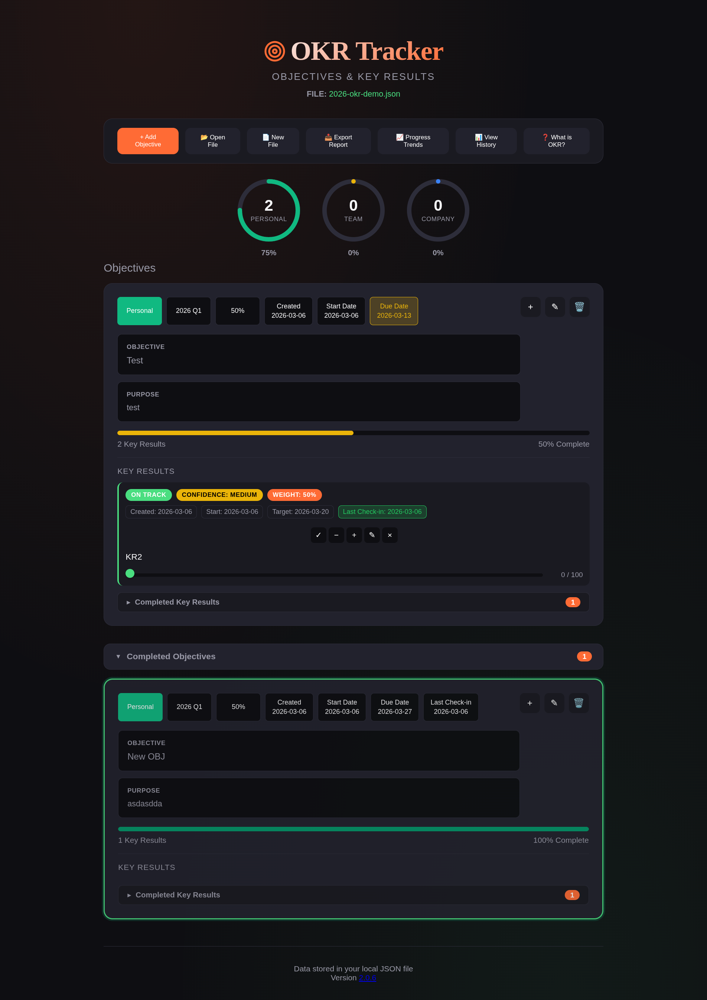

# OKR Tracker

A offline or server hosted web-based application for tracking Objectives and Key Results (OKRs). This tool helps individuals and teams set, monitor, and achieve their goals using the OKR framework popularized by companies like Google, Intel, and LinkedIn.

## Overview

OKR Tracker is an offline-capable web application that stores your OKR data in a local JSON file. It provides a clean, intuitive interface for managing objectives across three categories: Personal, Team, and Company. The application features progress tracking, status indicators, and comprehensive reporting capabilities.

## Features

- **File-Based Storage**: Data is stored in a local JSON file using the File System Access API
- **Three Group Categories**: Organize objectives by Personal, Team, or Company
- **Progress Tracking**: Visual progress indicators for objectives and key results
- **Status Management**: Track key results with status indicators (On Track, Off Track, At Risk)
- **Confidence Levels**: Set confidence levels (Low, Medium, High) for key results to indicate likelihood of achievement
- **Evidence and Comments**: Document progress with evidence and comments for each key result
- **Check-in Dates**: Track last check-in dates for objectives and key results
- **Weight Balancing**: Automatic weight distribution for objectives and key results
- **Export Reports**: Generate formatted text reports of your OKRs
- **Filtering**: Click on dashboard charts to filter objectives by group
- **Color-Coded Status**: Visual indicators for objective progress and due dates
- **Progress Trends & Analysis**: Visualize progress over time with interactive charts
- **Change History**: Track all changes to objectives and key results with timestamps and details

## Browser Requirements

This application requires a browser that supports the File System Access API:
- Google Chrome (recommended)
- Microsoft Edge
- Opera

Other browsers may not support file operations and will display a warning message.

## Getting Started

### Opening or Creating a File

1. Click "New File" to create a new OKR data file, or
2. Click "Open File" to open an existing JSON file containing your OKRs

The application will remember your last opened file and attempt to restore it when you reload the page.

### Adding an Objective

1. Click the "+ Add Objective" button
2. Fill in the required fields:
   - **Group**: Select Personal, Team, or Company
   - **Year**: The year for this objective
   - **Quarter**: Q1, Q2, Q3, or Q4
   - **Start Date**: When the objective begins
   - **Target Date**: The deadline for the objective
   - **Weight (%)**: Priority weight (will be auto-balanced if other objectives exist)
   - **Objective**: The main goal description
   - **Purpose**: Optional explanation of why this objective matters
   - **Last Check-in**: Optional date of last review
3. Click "Save Objective"

### Adding Key Results

1. Click the "+" button on an objective card
2. Fill in the required fields:
   - **Key Result Title**: Description of the measurable outcome
   - **Target Value**: The target number to achieve
   - **Weight (%)**: Priority weight relative to other key results
   - **Status**: On Track, Off Track, or At Risk
   - **Confidence**: Low, Medium, or High (indicates your confidence in achieving this key result)
   - **Start Date**: When tracking begins
   - **Target Date**: The deadline
   - **Last Check-in**: Optional date of last review
   - **Evidence**: Optional proof or documentation of progress
   - **Comments**: Optional notes about the key result
3. Click "Add Key Result"

### Updating Progress

- Use the "-" and "+" buttons on each key result to decrease or increase progress by 10 points
- Progress is automatically calculated based on current value vs. target value
- The progress bar updates in real-time

### Editing and Deleting

- Click the pencil icon to edit an objective or key result
- Click the trash icon to delete (with confirmation)
- Deleting an objective removes all its key results

### Filtering Objectives

Click on any of the three dashboard charts (Personal, Team, Company) to filter the objectives list to show only that group. Click the same chart again to clear the filter and show all objectives.

### Exporting Reports

Click "Export Report" to generate a formatted text file containing all your OKRs with their progress, status, confidence levels, dates, evidence, and comments.

### Viewing Progress Trends

Click "📈 Progress Trends" to visualize your progress over time. The trends feature offers two view modes:

1. **Grouped by Category** (default): Shows one chart with three lines representing the average progress for Personal, Team, and Company objectives over time. This view helps you compare overall progress across different categories. Only groups that currently have objectives are displayed.

2. **Individual Objectives**: Shows separate charts for each objective, allowing you to track individual objective progress. Use the filters to view specific groups or objectives.

**How Progress Tracking Works:**
- Progress snapshots are automatically recorded whenever you create, update, or modify objectives or key results
- Each snapshot captures the current progress percentage for all objectives and their key results at that moment
- If multiple changes occur on the same day, the snapshot for that day is updated (not duplicated)
- The chart displays a line connecting data points over time, showing how progress changes
- Data points appear on the chart only when changes occur - if no changes are made for several days, the line will jump from the last data point to the next one
- Progress data is stored in the history array within your JSON file, ensuring it persists across sessions

**Chart Features:**
- Interactive tooltips show group, date, progress percentage, and objective count when hovering over data points
- Color-coded lines: Personal (green), Team (yellow), Company (blue)
- Legend displays current progress percentage for each group
- X-axis shows dates, Y-axis shows progress percentage (0-100%)

### Viewing Change History

Click "📊 View History" to see a complete log of all changes made to your OKRs. The history includes:

- **Creation events**: When objectives and key results were created
- **Updates**: All field changes (title, dates, status, confidence, evidence, comments, etc.)
- **Progress changes**: When key result progress values are updated
- **Deletions**: When objectives or key results are removed
- **Progress snapshots**: Automatic snapshots of progress state (used for trends visualization)

Each entry shows:
- The type of item (Objective or Key Result)
- The item's title and group
- The timestamp of the change
- The type of change (Created, Updated, Progress, Deleted)
- Details of what changed (for updates and progress changes)

**History Storage:**
- All history entries are stored in the `history` array within your JSON file
- The system keeps the last 1000 history entries to prevent file bloat
- History data persists across sessions and is included when you export or backup your file
- Progress snapshots are stored as history entries with type 'progress-snapshot' and contain complete progress data for all objectives at that point in time

Use the filters to view history by item type (Objectives or Key Results) or by group (Personal, Team, Company).

## Progress Color Coding

### Objective Outline Colors

The objective cards display colored outlines based on due date and progress percentage:

- **Red Outline**: Past due date AND progress less than 70%
  - Indicates the objective is overdue and behind schedule

- **Yellow Outline**: Past due date AND progress 70% or higher
  - Indicates the objective is overdue but making good progress

- **Blue Outline**: Before or at due date AND progress 70% or higher (but less than 100%)
  - Indicates the objective is on track and meeting targets

- **Green Outline**: Before or at due date AND progress at 100%
  - Indicates the objective is complete and on time

### Progress Bar Colors

The progress bars within objectives use color coding based on completion percentage:

- **Blue (0-25%)**: Early stage, minimal progress
- **Yellow (26-55%)**: Moderate progress, needs attention
- **Light Green (56-69%)**: Good progress, approaching target
- **Dark Green (70-100%)**: Excellent progress, on track or complete

### Key Result Status Badges

Each key result displays several badges:

- **Status Badge**: Indicates the current state of the key result
  - **On Track (Green)**: Progress is meeting expectations
  - **Off Track (Yellow)**: Progress is below expectations, needs attention
  - **At Risk (Red)**: Progress is significantly behind, requires immediate action

- **Confidence Badge**: Shows your confidence level in achieving the key result
  - **Low**: Indicates uncertainty or significant challenges ahead
  - **Medium**: Indicates moderate confidence with some risks
  - **High**: Indicates strong confidence in achieving the target

- **Weight Badge**: Displays the priority weight percentage for the key result

### Date Warning Colors

Both Objective Due Date badges and Key Result Target Date badges use color coding to indicate urgency:

- **Yellow Badge**: One week (7 days) or less remaining until the target/due date
  - Indicates the deadline is approaching and requires attention

- **Red Badge**: Past the target/due date
  - Indicates the deadline has passed and the item is overdue

Additionally, Key Result Last Check-in badges will turn red if 8 days or more have passed since the last check-in date, indicating that the key result needs to be reviewed.

## Weight Balancing

The application automatically balances weights when you add new objectives or key results:

- **Objective Weights**: When you add a new objective, all objective weights are automatically balanced to total 100%
- **Key Result Weights**: When you add a new key result, all key result weights within that objective are automatically balanced to total 100%
- **Manual Adjustment**: You can manually set weights, and the remaining weights will be automatically adjusted
- **Balance Buttons**: Use the "Balance All" button for objectives or "Balance KRs" button for key results to manually redistribute weights equally

## Data Storage and Privacy

### Local File Storage

All OKR data is stored locally in a JSON file on your computer. The application uses the File System Access API to save data directly to your chosen file. Your OKR information never leaves your computer and is never sent to external servers.

**Important**: The JSON file is stored in **unencrypted** format. This means:
- The file is readable as plain text
- Anyone with access to the file can read its contents
- You are responsible for securing the file location and access permissions

### Browser Storage (IndexedDB)

The application uses IndexedDB (a browser storage mechanism) to store a minimal amount of metadata:

**What is stored:**
- File handle reference: A reference to the last opened JSON file (stored under the key 'okr_last_file' in an IndexedDB database named 'OKRTracker')
- This is only metadata that helps the application remember which file you last opened

**What is NOT stored:**
- Your actual OKR data (objectives, key results, progress, etc.)
- Any personal information beyond the file reference
- Any data that could be used to reconstruct your OKRs

### What Happens When Browser Cache is Cleared

If you clear your browser's cache or IndexedDB data:

1. **Your OKR data remains safe**: All your objectives, key results, and progress data remain intact in your JSON file on your computer
2. **File handle is lost**: The application will no longer remember which file you last opened
3. **Action required**: You will need to manually open your JSON file again using the "Open File" button
4. **No data loss**: Your actual OKR data is unaffected since it's stored in the file, not in browser storage

### Privacy and Security

- **No network transmission**: The application operates entirely offline and does not send any data over the internet
- **No cloud storage**: All data remains on your local machine
- **No tracking**: The application does not collect analytics, usage statistics, or any tracking information
- **File security**: Since data is stored in an unencrypted JSON file, ensure you:
  - Store the file in a secure location
  - Use appropriate file system permissions
  - Consider encrypting the file or folder if storing sensitive information
  - Be cautious when sharing the file with others

## Keyboard Shortcuts

- **Escape**: Close any open modal dialog

## Tips for Effective OKR Management

1. **Keep Objectives Focused**: Limit yourself to 3-5 objectives per quarter
2. **Set Measurable Key Results**: Each objective should have 2-5 key results with specific, quantifiable targets
3. **Regular Check-ins**: Update your last check-in dates weekly to maintain accountability
4. **Use Evidence**: Document your progress with evidence to track what's working
5. **Review Status**: Regularly update key result status to reflect current reality
6. **Set Confidence Levels**: Use confidence indicators to identify which key results may need more attention
7. **Balance Weights**: Use weight balancing to ensure priorities are clear
8. **Track Trends**: Use the Progress Trends feature to identify patterns and trends in your progress over time
9. **Review History**: Check the change history regularly to understand what's working and what needs adjustment
10. **Export Regularly**: Generate reports periodically to review progress and share updates

## Troubleshooting

**File won't open**: Ensure you're using a supported browser (Chrome, Edge, or Opera) and that you have permission to access the file.

**Data not saving**: Check that you have write permissions for the file location and that the file isn't open in another application.

**Charts not updating**: Refresh the page or re-open your file to ensure the dashboard displays current data.

**Filter not working**: Click on a different chart or refresh the page to reset the filter state.

## License

This project is licensed under the MIT License.

